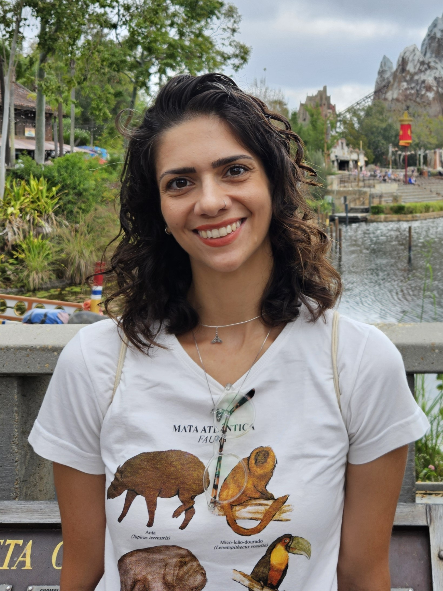

:::::: hero
::::: {.columns .v-center}
::: {.column width="65%"}
# Ana Paula Lula Costa

### Ecologist · Researcher · Disease Ecology · One Health

I am an ecologist interested in understanding how biodiversity, ecological interactions and environmental change shape disease dynamics.

My research integrates **community ecology, landscape ecology, ecological networks, eco-evolutionary dynamics and One Health** to investigate how environmental change affects host–parasite interactions and the emergence of infectious diseases.

[Explore my research](research.qmd){.btn .btn-primary} [Get in touch](contact.qmd){.btn .btn-outline-primary}
:::

::: {.column width="35%"}
{.profile-image}
:::
:::::
::::::
